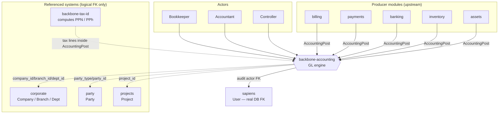
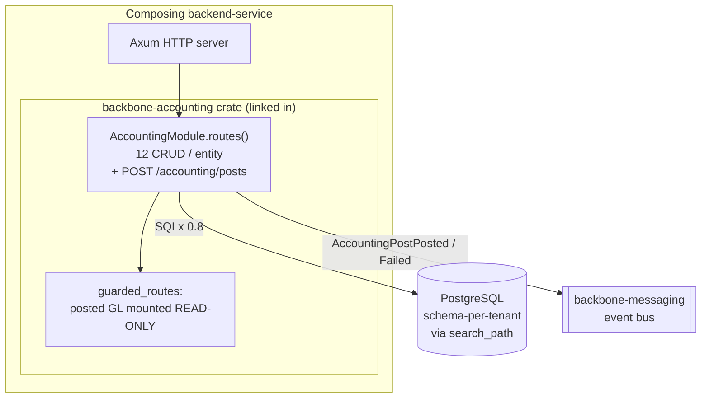
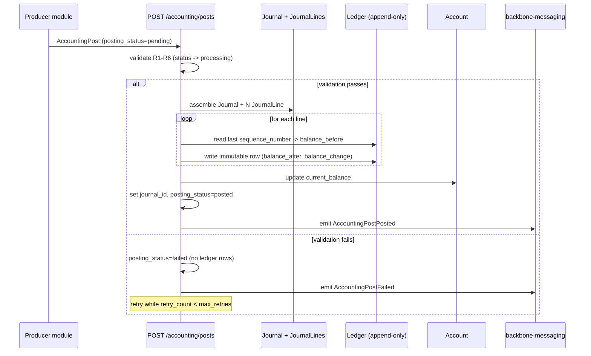

# Architecture

> Reader: **maintainer** · Mode: **explanation** (C4-style, top-down).

`backbone-accounting` is a **library crate** (`[lib]` only, no `main.rs`) — it is *not* itself deployable. It owns the accounting bounded context and is linked into a composing `backend-service`, which runs the Axum HTTP server, opens the PostgreSQL pool, and mounts the module's routes. Everything below describes the crate as it is consumed inside such a service.

The point: accounting is a **general-ledger engine**. Producer modules throw immutable financial facts (`AccountingPost`) at one endpoint; the module validates, journalizes, writes an append-only ledger with running balances, and emits events. It imports **no producer module** and never calls back into one. For the *why* behind this stance, see [./philosophy.md](./philosophy.md) and [ADR-001](./adr/ADR-001-gl-core-boundary.md). Terms are defined in [./glossary.md](./glossary.md).

---

## 1. Context (C4 L1)

*Notice:* every arrow into accounting is one-directional. Producers push `AccountingPost`; accounting never imports or calls them (no synchronous callback). All of `corporate`, `party`, `projects` are **logical FKs** — no DB constraint, resolved by ID only. `sapiens.User` is the **single real DB FK import**, used for audit actors. `backbone-tax-id` does not integrate directly: it computes PPN/PPh upstream and delivers tax lines *inside* the `AccountingPost` payload.

---

## 2. Containers (C4 L2)

*Notice:* the crate is a passenger — the `backend-service` owns the process, the pool, and the port. The module contributes a `Router`. Two write surfaces exist: the standard **12 Backbone CRUD endpoints per entity** (at `/api/v1/{collection}`, via `BackboneCrudHandler`) and the one non-CRUD **`POST /accounting/posts`** — the entire system's GL write path. `create_guarded_accounting_routes(&module)` remounts the four posted GL entities (Journal, JournalLine, Ledger, AccountingPost) **read-only**: their only sanctioned writer is the posting path. Master/config entities keep full CRUD. Persistence is **schema-per-tenant** — isolation is a `search_path` concern, not a `provider_id` column (see [ADR-001 #4](./adr/ADR-001-gl-core-boundary.md)). Events are published to `backbone-messaging`.

---

## 3. Components / modules (C4 L3)

The crate follows the standard DDD 4-layer shape. `lib.rs` holds the `AccountingModule` and its builder.

| Layer | Path | Responsibility |
|-------|------|----------------|
| Domain | `src/domain/{entity,repositories}` | Entity structs; repository ports. |
| Application | `src/application/{service,dto,workflows}` | Service type aliases; DTOs; posting workflow. |
| Infrastructure | `src/infrastructure/{persistence,cache,messaging,jobs}` | Repository newtypes; caching; event publishing; background jobs. |
| Presentation | `src/presentation/{http,dto,middleware,grpc}` | Handlers; wire DTOs; middleware; gRPC (**present but disabled**). |
| Composition | `src/routes/`, `src/seeders/` | Route composers (stateless + stateful); test-data seeders. |

**Services** are type aliases to `GenericCrudService`; **repositories** are thin newtypes over `GenericCrudRepository`. The `AccountingModule` builder wires all **10 services**, e.g. `AccountRepository::new(pool.clone())` → `AccountService::with_repository(repo)`, inside `// <<< CUSTOM` / `// END CUSTOM` markers reserved for custom wiring.

```mermaid
graph LR
    B["AccountingModule::builder()<br/>.with_database(pool).build()?"]
    B --> S1[AccountService]
    B --> S2[AccountingPostService]
    B --> S3[CostCenterService]
    B --> S4[FinancialStatementService]
    B --> S5[FiscalPeriodService]
    B --> S6[JournalService]
    B --> S7[JournalLineService]
    B --> S8[LedgerService]
    B --> S9[ReconciliationService]
    B --> S10[ReconciliationItemService]
    S1 -.type alias.-> G[GenericCrudService]
    S6 -.type alias.-> G
    S8 -.type alias.-> G
    R[Repository newtypes] -.wrap.-> GR[GenericCrudRepository]
    G --> R
```

*Notice:* there is no hand-rolled service `impl` and no ad-hoc repository — everything routes through `GenericCrudService` / `GenericCrudRepository`. The 10 entities are: **Account, AccountingPost, CostCenter, FinancialStatement, FiscalPeriod, Journal, JournalLine, Ledger, Reconciliation, ReconciliationItem**.

**gRPC is present-but-disabled.** `tonic 0.12` and `prost` are declared in `Cargo.toml`, but `index.model.yaml` disables the `graphql`, `grpc`, and `proto` generators — so no gRPC/proto code is currently generated.

**Cascade-child exception:** `JournalLine` and `ReconciliationItem` carry no `@audit_metadata`, so their `soft_delete` / `restore` / `empty_trash` / `list_deleted` endpoints are **not** generated — they are managed through their parent aggregate.

For how to extend safely, see [./extension-guide.md](./extension-guide.md) and [./developer-guide.md](./developer-guide.md).

---

## 4. Data & control flow — posting an `AccountingPost`

The posting path (`POST /accounting/posts`) is the only sanctioned GL writer. It runs the FSD §4 hooks (`validate_posting`, `assemble_journal`, `write_ledger`, `update_account_balance`, `emit_post_event`) in sequence.

*Notice:* the ledger is **append-only** (R8) and each row computes its running balance from the previous `sequence_number` (`balance_before`), then sets `balance_after` / `balance_change` (R9). On the **failure path** no ledger rows are written — `posting_status=failed`, `AccountingPostFailed` is emitted, and the post is retried while `retry_count < max_retries`. There is no synchronous callback into the producer; the only signals back are the two Tier-A events: `AccountingPostPosted { post_id, source_type, source_id, journal_id, status }` and `AccountingPostFailed { post_id, source_type, source_id, error_code, error_message }`.

**Idempotency** is enforced at the DB layer: a partial unique index on `(company_id, source_type, source_id, posting_type) WHERE posting_status='posted'` blocks double-posting the same source fact ([ADR-002](./adr/ADR-002-ledger-write-path-integrity.md)).

**Reversal, briefly:** posted entries are never edited (R7). A reversal produces a **mirror journal** (via the `link_reversal` hook), which lands in the current open period — the `block_closed_period` hook prevents writes into closed periods.

Rules R1–R11 and golden cases G1–G8 live in [./brd.md](./brd.md); the posting flow and hook contracts are detailed in [./fsd.md](./fsd.md).

---

## 5. Where to change what

See [./maintainer-guide.md](./maintainer-guide.md) for procedures; this table points you at the right layer.

| To change… | Go to |
|------------|-------|
| An entity's fields, columns, or CRUD surface | schema YAML (SSoT) → regenerate; see [./maintainer-guide.md](./maintainer-guide.md) |
| Posting validation, journalizing, ledger, balance, events | hooks in `schema/hooks/` (`validate_posting`, `assemble_journal`, `write_ledger`, `update_account_balance`, `emit_post_event`, `link_reversal`, `block_closed_period`) + `application/workflows` |
| Custom business logic on a service | `*_service_custom.rs` or `// <<< CUSTOM` markers |
| Service wiring / new entity registration | `AccountingModule` builder in `lib.rs` (CUSTOM markers) |
| Which GL entities are read-only vs full CRUD | `src/presentation/http/guarded_routes.rs` |
| Event publishing / bus integration | `src/infrastructure/messaging` |
| Tenant isolation / `search_path` behavior | [ADR-001](./adr/ADR-001-gl-core-boundary.md); persistence layer |
| Idempotency / ledger write-path integrity | migrations (partial unique index) + [ADR-002](./adr/ADR-002-ledger-write-path-integrity.md) |
| Adding a non-CRUD endpoint | handler in `presentation/http/` + composer in `routes/`; see [./extension-guide.md](./extension-guide.md) |
